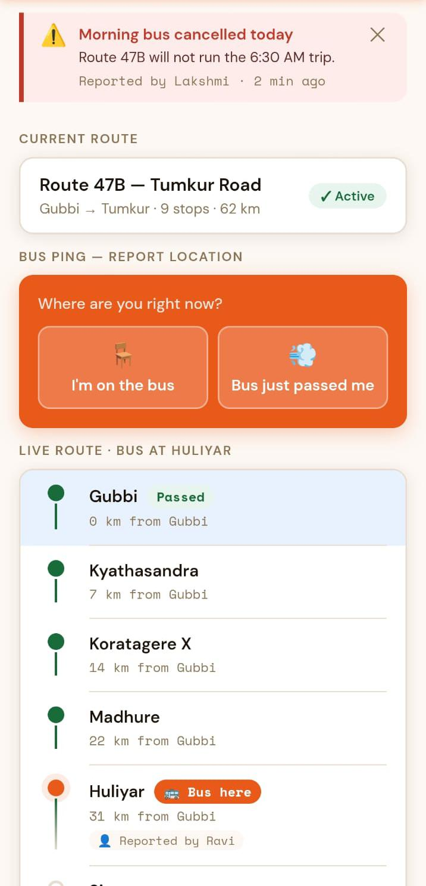
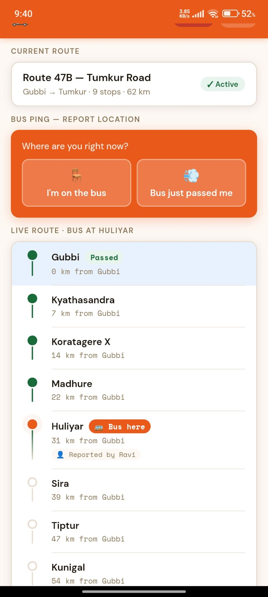
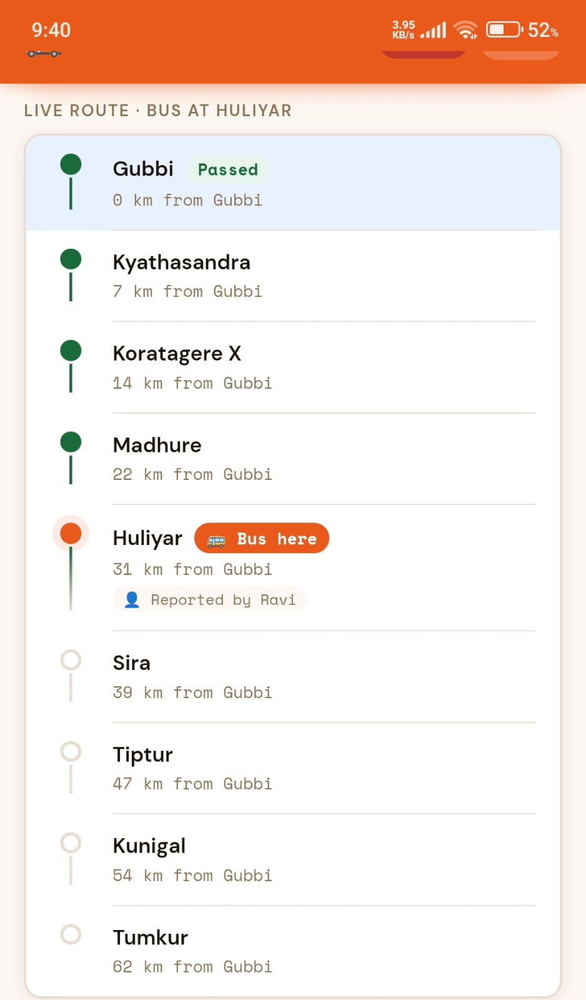
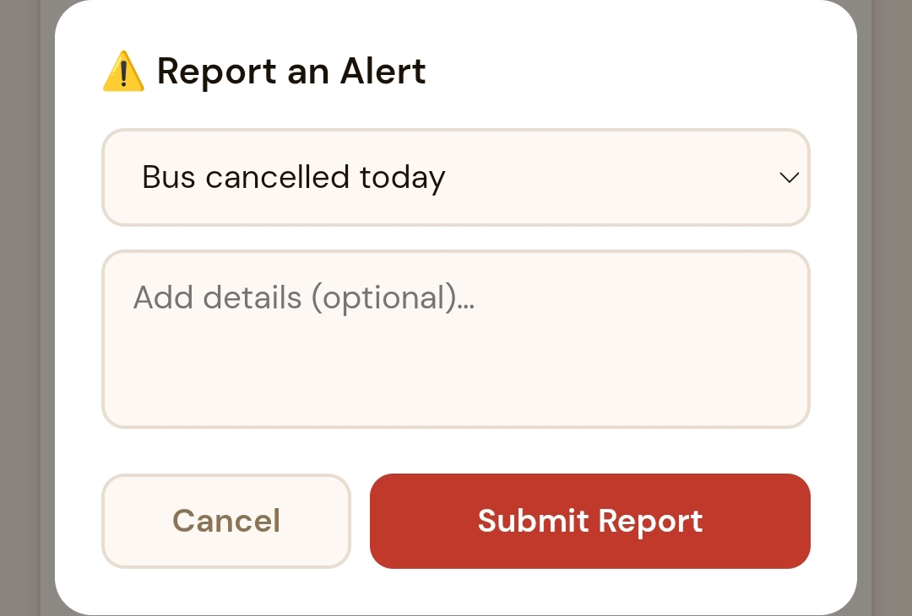

# Grama-Yatri 🚍

## Community Powered Rural Bus Tracking System

Grama-Yatri is a realtime rural bus tracking Android application designed to help villagers, students, and daily commuters track bus movement collaboratively using community-generated updates.

Instead of depending on expensive GPS hardware or large-scale transport infrastructure, the application allows passengers themselves to report live bus movement using simple actions such as:

- "I'm on the bus"
- "Bus just passed me"

The application uses Firebase Realtime Database to instantly synchronize updates across multiple devices.

---

# 📌 Problem Statement

In many rural areas, bus timings are highly unpredictable and passengers often miss buses due to the absence of realtime tracking systems. Students, workers, and villagers may need to wait for long periods without knowing the current location or expected arrival time of buses.

Most existing transportation applications are designed primarily for urban transit systems and require costly GPS infrastructure that may not be feasible in rural regions.

Grama-Yatri addresses this problem through a lightweight, low-cost, community-powered realtime tracking system.

---

# ✨ Features

## 🚏 Realtime Route Tracking
- Displays village stops in a timeline/stepper format
- Highlights current bus location
- Shows live route progression

## 📡 Community Bus Ping System
Passengers can collaboratively update bus movement using:
- “I’m on the bus”
- “Bus just passed me”

## ⏱ Live ETA Calculation
- Calculates Estimated Time of Arrival (ETA)
- Dynamic updates based on bus progression

## 🔄 Firebase Realtime Synchronization
- Instant updates across multiple devices
- Shared live bus state
- Cloud-based synchronization

## ⚠ Alert System
Users can broadcast transport alerts such as:
- Bus cancellation
- Delays
- Route changes
- Bus breakdowns

## 📱 Lightweight Android Application
- Low-data usage
- Fast loading
- Simple rural-friendly interface

---

# 🛠 Technology Stack

| Component | Technology |
|---|---|
| Frontend | HTML, CSS, JavaScript |
| Android Wrapper | Android Studio WebView |
| Backend | Firebase Realtime Database |
| Realtime Communication | Firebase SDK |
| Build System | Gradle |
| Version Control | Git & GitHub |

---

# 🏗 System Architecture

```text
User Reports Bus Location
            ↓
Firebase Realtime Database
            ↓
Realtime Event Listener
            ↓
All Connected Devices Update Instantly
```

---

# 📂 Project Structure

```text
GramaYatri/
│
├── app/
│   ├── src/
│   │   ├── main/
│   │   │   ├── assets/
│   │   │   │   ├── index.html
│   │   │   │   ├── style.css
│   │   │   │   └── app.js
│   │   │   └── java/
│   │   │       └── MainActivity.kt
│   └── build.gradle
│
├── gradle/
├── settings.gradle
└── README.md
```

---

# 🔥 Firebase Integration

The application uses Firebase Realtime Database for live synchronization.

## Firebase Features Used

- Realtime Database
- Cloud synchronization
- Shared bus state management
- Realtime event listeners

## Sample Database Structure

```json
{
  "currentBusStop": {
    "stop": 2,
    "reporter": "Ravi",
    "type": "onbus",
    "timestamp": 1710000000
  }
}
```

---

# 🚀 Installation & Setup

## Prerequisites

- Android Studio
- Firebase Project
- Android Emulator or Physical Android Device

---

## Clone Repository

```bash
git clone https://github.com/yourusername/GramaYatri.git
```

---

## Open in Android Studio

1. Open Android Studio
2. Select "Open Project"
3. Choose the GramaYatri folder

---

## Firebase Setup

1. Create a Firebase project
2. Enable Realtime Database
3. Add Firebase configuration in:

```text
app/src/main/assets/index.html
```

4. Enable database rules for testing:

```json
{
  "rules": {
    ".read": true,
    ".write": true
  }
}
```

---

## Run the Application

```text
Build → Run App
```

or:

```bash
Shift + F10
```

---

# 📸 Screenshots


### Home Screen


---

### Route Tracking


---

### ETA Display


---

### Alert System


### Alert System Functions


---

### Alert System Options


### Firebase Realtime Sync


---

# 🧪 Testing

| Testing Type | Status |
|---|---|
| UI Testing | ✅ Passed |
| Firebase Realtime Sync | ✅ Passed |
| Multi-device Testing | ✅ Passed |
| APK Build Testing | ✅ Passed |
| Android Device Testing | ✅ Passed |

---

# 🌍 Expected Impact

Grama-Yatri aims to improve rural transportation accessibility by:

- Reducing passenger waiting time
- Improving travel reliability
- Helping students and workers commute efficiently
- Providing low-cost realtime transport information
- Encouraging community participation

---

# 🔮 Future Enhancements

- GPS-based live tracking
- Google Maps integration
- Push notifications
- Multiple route support
- User authentication
- Admin dashboard
- AI-based ETA prediction
- Offline caching
- Dark mode

---

# 👨‍💻 Developer

**Faisal Khan**

Final Year AIML Student

---

# 📄 License

This project is developed for educational and internship demonstration purposes.

---

# ⭐ Acknowledgements

- Firebase Documentation
- Android Studio Documentation
- Open-source Android Developer Community
